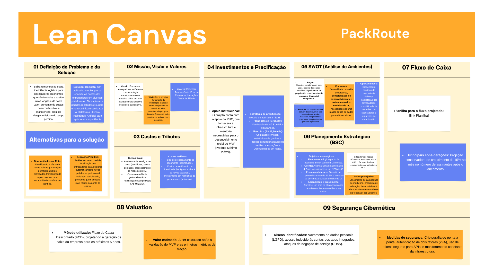

# 📌 PackRoute

O PackRoute é uma plataforma de otimização logística para entregadores autônomos. Identificamos que, diariamente, motoqueiros perdem tempo e dinheiro com rotas ineficientes. Nossa solução é um aplicativo que integra múltiplas fontes de pedidos, utilizando **algoritmos de Inteligência Artificial** para criar a rota mais eficiente, prever tempos e personalizar a experiência para cada entregador.

O entregador pode, em uma mesma viagem, coletar um pedido em um restaurante, passar em uma farmácia e finalizar em um mercado, maximizando seus ganhos por quilômetro rodado e reduzindo o tempo ocioso.

## 👥 Integrantes

* Pedro Henrique Franco Moreira Amaral – RA: 819472
* Rafael de Souza Felisberto – RA: 804810
* José Ulisses Bueno - RA: 825579
* Matheus Militão Santos - RA: 806456
* Vinicius Henrique Muniz Penido - RA: 788527

## 🧭 Etapas do Projeto

### 1️⃣ Definição do Problema e da Solução

* **Problema identificado:** Baixa remuneração e alta ineficiência logística para entregadores autônomos, que são forçados a aceitar rotas longas e de baixo valor, aumentando custos com combustível e manutenção, além do desgaste físico e do tempo perdido.
* **Público-alvo:** Entregadores de delivery (motoqueiros e ciclistas) que trabalham com múltiplos aplicativos.
* **Impacto esperado:** Aumento na renda mensal dos entregadores, redução do tempo em trânsito, diminuição da emissão de carbono por entrega e melhoria na qualidade de vida do profissional.
* **Solução proposta:** Um aplicativo mobile que se conecta às contas dos entregadores em diversas plataformas. Ele captura os pedidos recebidos e sugere uma rota única e otimizada. A plataforma utilizará **Inteligência Artificial** para aprimorar a experiência com:
    * **Despacho Preditivo:** Análise em tempo real da localização dos entregadores para designar automaticamente novos pedidos ao profissional mais bem posicionado, prevendo quem chegará mais rápido ao ponto de coleta.
    * **Recomendações Personalizadas:** O sistema aprende com o histórico de cada usuário para sugerir proativamente os pedidos que mais se alinham às suas preferências (tipo de produto, distância, valor, horários).
    * **Oportunidades em Rota:** Identificação e oferta de novas coletas que estejam no trajeto atual do entregador, transformando o percurso em uma oportunidade contínua de ganhos.

### 2️⃣ Lean Canvas / Missão, Visão e Valores

* **Lean Canvas:** \[(https://www.canva.com/design/DAGxLP5aZAk/_MDWNrhVh8uj4upFEzWAQQ/edit?utm_content=DAGxLP5aZAk&utm_campaign=designshare&utm_medium=link2&utm_source=sharebutton)]
* [](https://www.canva.com/design/DAGxLP5aZAk/_MDWNrhVh8uj4upFEzWAQQ/edit?utm_content=DAGxLP5aZAk&utm_campaign=designshare&utm_medium=link2&utm_source=sharebutton)
* **Missão:** Empoderar entregadores autônomos com tecnologia, transformando seu trabalho diário em uma atividade mais lucrativa, eficiente e sustentável.
* **Visão:** Ser a principal ferramenta de otimização e gestão para entregadores na América Latina, reconhecida por gerar impacto financeiro real e positivo na vida de seus usuários.
* **Valores:** Eficiência, Transparência, Foco no Entregador, Inovação e Sustentabilidade.

### 3️⃣ Custos e Tributos (Plano de Negócios - PNBOX)

* **Custos fixos:**
    * Assinatura de serviços de cloud (servidores, banco de dados, processamento de modelos de IA).
    * Custo com APIs de geolocalização e roteirização (Google Maps API, Mapbox).
    * Salários da equipe (desenvolvedores, cientista de dados, suporte).
* **Custos variáveis:**
    * Taxas de processamento de pagamento (assinaturas).
    * Custos de verificação de identidade (background check de novos usuários).
    * Investimento em marketing de performance (anúncios).
* **Tributos aplicáveis:** Simples Nacional (como MEI ou Microempresa), incidindo sobre o faturamento da plataforma.

### 4️⃣ Investimentos e Precificação

* **Apoio Institucional:** O projeto conta com o apoio da PUC, que fornecerá a infraestrutura e mentoria necessárias para o desenvolvimento inicial do MVP (Produto Mínimo Viável).
* **Estratégia de precificação:** Modelo de assinatura (SaaS).
    * **Plano Básico (Gratuito):** Otimização de até 3 pedidos simultâneos.
    * **Plano Pro (R$ 29,90/mês):** Otimização ilimitada, estatísticas de ganhos e acesso às funcionalidades de IA (Recomendações e Oportunidades em Rota).
* **Justificativa:** O modelo de assinatura cria uma receita recorrente. O valor do plano Pro é facilmente coberto pelo aumento de ganhos que a plataforma proporciona, tornando a proposta de valor clara.

### 5️⃣ SWOT (Análise de Ambientes)

* **Forças:** Solução inovadora com forte apelo, modelo de negócio escalável, **algoritmo de IA proprietário como barreira de entrada e diferencial competitivo**.
* **Fraquezas:** Dependência das APIs de terceiros, **complexidade no desenvolvimento e treinamento dos modelos de IA**, necessidade de uma massa crítica de dados para a IA ser eficaz.
* **Oportunidades:** Crescimento contínuo do mercado de delivery, insatisfação dos entregadores, possibilidade de parcerias com seguradoras e empresas de manutenção.
* **Ameaças:** Os próprios apps de delivery desenvolverem uma funcionalidade similar, mudanças nas políticas de privacidade das plataformas, questões regulatórias.

### 6️⃣ Planejamento Estratégico (BSC)

* **Objetivos estratégicos:**
    * **Financeiro:** Atingir o ponto de equilíbrio (break-even) em 18 meses.
    * **Cliente:** Alcançar uma nota média de 4.7 nas lojas de apps e um NPS de 60.
    * **Processos Internos:** Garantir um uptime do serviço de 99.8% e acurácia de 95% nas previsões de ETA da IA.
    * **Aprendizado e Crescimento:** Construir um time de alta performance em desenvolvimento e ciência de dados.
* **Indicadores e metas:** Número de assinantes ativos, CAC, LTV, taxa de churn, engajamento com as features de IA.
* **Ações planejadas:** Lançamento de campanhas de marketing, programa de indicação, desenvolvimento de novas features com base no feedback dos usuários.

### 7️⃣ Fluxo de Caixa

* **Planilha do fluxo projetado:** \[Link para a planilha de Fluxo de Caixa projetado para 24 meses]
* **Principais considerações:** Projeção conservadora de crescimento de 15% ao mês no número de assinantes após o lançamento.

### 8️⃣ Valuation

* **Método utilizado:** Fluxo de Caixa Descontado (FCD), projetando a geração de caixa da empresa para os próximos 5 anos.
* **Valor estimado:** A ser calculado após a validação do MVP e as primeiras métricas de tração.

### 9️⃣ Segurança Cibernética

* **Riscos identificados:** Vazamento de dados pessoais (LGPD), acesso indevido às contas dos apps integrados, ataques de negação de serviço (DDoS).
* **Medidas de segurança:** Criptografia de ponta a ponta, autenticação de dois fatores (2FA), uso de tokens seguros para APIs, e monitoramento constante da infraestrutura.

## 📅 Diário de Bordo

| Data       | Conteúdo/Etapa                    | Status         | Observações                                      |
|------------|-----------------------------------|----------------|--------------------------------------------------|
| 06/08/2025 | Apresentação Disciplina + Start   | ✅ Concluído    | -                                                |
| 13/08/2025 | Definição dos Grupos e Propostas  | ✅ Concluído    | Proposta do PackRoute aprovada.                  |
| 20/08/2025 | Criação do Lean Canvas            | ✅ Concluído    | -                                                |
| 21/08/2025 | Estruturação do README.md         | ✅ Concluído    | Documento base criado.                           |
| 21/08/2025 | Definição da estratégia de IA     | ✅ Concluído    | Brainstorm de features de IA para V2 do produto. |

## 📦 Entregas

| Entrega                                | Data       | Descrição                                                       | Status         |
|----------------------------------------|------------|-----------------------------------------------------------------|----------------|
| Lean Canvas                            | 20/08/2025 | Documento e imagem do canvas                                    | 🚧 Em andamento |
| Custos e Tributos                      | 27/08/2025 | Planilha com custos fixos, variáveis e tributos                 | ⏳ A fazer      |
| Análise SWOT / Plano de Negócios       | 24/09/2025 | Análise de ambientes SWOT e entrega do Plano de Negócios        | ⏳ A fazer      |
| Fluxo de Caixa / Planejamento Estratégico | 15/10/2025 | Planilha de fluxo de caixa e entrega do Planejamento Estratégico  | ⏳ A fazer      |
| Valuation                              | 05/11/2025 | Relatório com cálculo de valuation                              | ⏳ A fazer      |
| Apresentação Final                     | 12/11/2025 | Pitch final do projeto PackRoute                                | ⏳ A fazer      |

## 🗣️ Feedbacks Recebidos

| Data       | De Quem     | Feedback                                                                 | Ação Tomada                                     |
|------------|-------------|--------------------------------------------------------------------------|-------------------------------------------------|
| 24/09/2025 | Professor X | Melhorar clareza da análise SWOT                                         | Revisão feita                                   |
| 15/10/2025 | Mentor Y    | A estratégia de precificação pode ter um tier "premium" com mais benefícios. | Anotar para discutir e implementar no V2. |

## 📚 Lições Aprendidas

* **Validação é chave:** Aprendemos que antes de escrever uma linha de código, é fundamental conversar com o público-alvo para entender suas dores reais.

## 💡 Sugestão de Tecnologias (Stack)

* **Frontend (Aplicativo Mobile):**
    * **React Native** ou **Flutter:** Para criar um aplicativo para Android e iOS com um único código-base.
* **Backend (Servidor e Lógica):**
    * **Python com FastAPI ou Django:** É a escolha principal devido ao seu ecossistema maduro para IA/ML. FastAPI é ideal para criar APIs de alta performance, enquanto Django oferece uma estrutura mais robusta.
    * **Node.js com Express/NestJS:** Uma alternativa viável para gerenciar operações em tempo real e APIs.
* **🤖 Inteligência Artificial e Machine Learning (Python):**
    * **Pandas & GeoPandas:** Para manipulação e análise de dados tabulares e geoespaciais, que são a base para o treinamento dos modelos.
    * **Scikit-learn:** Para construir os modelos iniciais de previsão (ETAs), recomendação e clustering de entregadores/pedidos.
    * **TensorFlow ou PyTorch:** Para desenvolver modelos mais complexos de deep learning no futuro, como redes neurais para resolver problemas de otimização de rotas em tempo real.
* **Banco de Dados:**
    * **PostgreSQL com PostGIS:** A escolha mais robusta para trabalhar com dados geoespaciais, essencial para calcular rotas e distâncias com precisão.
* **Infraestrutura e APIs:**
    * **Cloud:** AWS, Google Cloud ou Azure para hospedar a aplicação.
    * **APIs de Mapa:** Google Maps API ou Mapbox para visualização de mapas, geocodificação e roteirização.

## 📁 Organização do Repositório

```
📦 packroute/
 ┣ 📂 data/
 ┃ ┣ 📄 datasets/
 ┃ ┗ 📓 notebooks/ (Notebooks Jupyter para análise e treinamento de modelos)
 ┣ 📂 docs/
 ┃ ┣ lean_canvas.png
 ┃ ┣ ... (outros documentos)
 ┣ 📂 src/
 ┃ ┣ 📱 mobile/ (Código do app em React Native/Flutter)
 ┃ ┗ ☁️ backend/ (Código do servidor em Python)
 ┣ README.md
